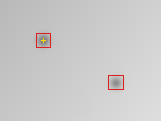
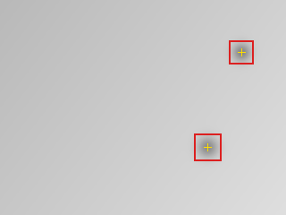

# SensorSieve

**Find the sensor spots that survive every frame, then prove what changed after cleaning.**

SensorSieve is an offline, read-only CLI for repeated flat-field JPEG/PNG captures. It removes smooth illumination falloff from the analysis, finds dark features that persist across frames, and produces numeric reports plus annotated overlays. The `compare` workflow classifies spots as resolved, persistent, or new.

| Before | After |
|---|---|
|  |  |

The images above are deterministic synthetic fixtures. SensorSieve never edits source photographs and does not provide cleaning instructions.

## Why this exists

A single bright-wall photo can contain wall texture, smooth falloff, JPEG noise, and transient shadows. SensorSieve requires at least three captures, normalizes each against a smooth illumination field, and keeps only dark features that persist. The same typed result drives JSON, CSV, overlays, summaries, and exit codes, so the outputs cannot silently disagree.

Unlike a photo-repair or inpainting tool, SensorSieve answers:

> Which dark features persist across my calibration captures, and which changed between two sessions?

See [research and differentiation](docs/RESEARCH.md) and the [method decision](docs/decisions/0001-multiframe-read-only-analysis.md).

## Quick start

From a checkout:

```powershell
uv sync --extra dev
uv run python scripts/build_examples.py

uv run sensorsieve inspect examples/before --output before-report
# exit 1: two persistent spots need review

uv run sensorsieve compare examples/before examples/after --output comparison-report
# exit 1: one resolved, one persistent, one new

uv run sensorsieve inspect examples/clean --output clean-report
# exit 0: no persistent spots
```

From the GitHub Release wheel:

```powershell
uvx --from https://github.com/KanadeK/sensorsieve/releases/download/v0.1.0/sensorsieve-0.1.0-py3-none-any.whl sensorsieve --version
```

## Capture a session

1. Make three or more same-size JPEG or PNG photographs of an evenly lit bright surface.
2. Defocus the scene and move the camera slightly between frames so wall texture does not remain at one sensor coordinate.
3. Keep exposure bright but not clipped. SensorSieve rejects a mean below 15%, above 95%, or more than 10% clipped pixels.
4. Put only that session's images in one directory, then run `inspect`.

SensorSieve reads EXIF orientation only to align pixels; it does not copy EXIF or source paths into reports. It supports 3-32 JPEG/PNG files, up to 100 MiB each, and keeps Pillow's decompression-bomb protection enabled.

## Commands

```text
sensorsieve inspect INPUT_DIR --output OUTPUT_DIR [--sensitivity FLOAT] [--max-side INT]
sensorsieve compare BEFORE_DIR AFTER_DIR --output OUTPUT_DIR [--sensitivity FLOAT] [--max-side INT]
sensorsieve --version
```

- `--sensitivity`: `2.0` to `12.0`; higher values report fewer spots. Default: `4.0`.
- `--max-side`: analysis resolution from `512` to `8192` pixels. Default: `2048`.
- Output must be a missing or empty real directory. SensorSieve does not overwrite owner files.

### Exit codes

| Code | `inspect` | `compare` |
|---|---|---|
| `0` | No persistent spots | No persistent or new spots |
| `1` | Persistent spots need review | Persistent or new spots need review |
| `2` | Invalid input, capture, arguments, or output | Invalid input, capture, arguments, or output |

Resolved-only comparisons exit `0`: the evidence says the earlier candidates disappeared and no candidate now needs review.

## Artifacts

`inspect` writes:

- `report.json`: schema-versioned result with normalized image and mirrored sensor guidance coordinates;
- `spots.csv`: one numeric row per candidate;
- `overlay.png`: the median flat-field frame with candidate boxes and centers;
- `summary.txt`: a concise human handoff.

`compare` writes `report.json`, `changes.csv`, `before-overlay.png`, `after-overlay.png`, and `summary.txt`. See the committed [inspection demo](docs/demo/before/report.json) and [comparison demo](docs/demo/comparison/report.json).

Image coordinates use the displayed image's top-left origin. Sensor guidance mirrors both axes because a mark seen in one image corner is commonly located in the opposite physical sensor corner when viewed from the front. Camera orientation behavior differs, so treat it as guidance, not permission to touch the sensor.

## Honest limits

- A persistent dark feature is a candidate, not proof of dust.
- Default downsampling bounds memory and may miss very small defects.
- Position matching does not prove that two features share a physical cause.
- RAW, FITS, TIFF, inpainting, camera tethering, and hosted uploads are intentionally absent.
- SensorSieve is not laboratory calibration and does not judge or teach physical cleaning.

## Development and acceptance

```powershell
uv --cache-dir .uv-cache sync --extra dev
uv --cache-dir .uv-cache run --extra dev pytest tests/test_detection.py
pwsh -NoProfile -File scripts/check.ps1
```

The full gate runs Ruff, format, strict mypy, branch coverage, wheel/sdist builds, dependency audit, deterministic example regeneration, all three exit paths, committed-demo comparison, and installed-wheel smoke tests. See [repair guidance](docs/REPAIR.md), [contribution rules](CONTRIBUTING.md), [security policy](SECURITY.md), and the exact [v0.1.0 spec](SPEC.md).

## License

MIT

